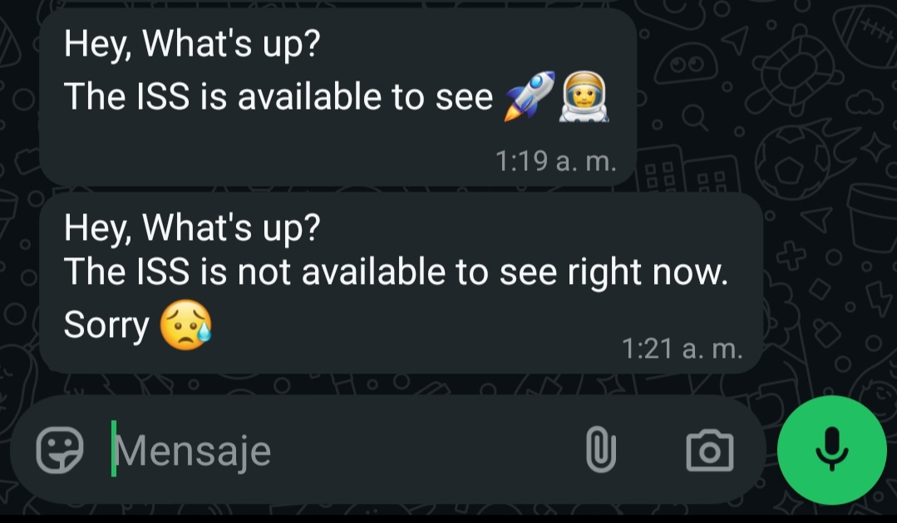

# 🌌 ISS Notifier

Este proyecto te permite recibir notificaciones por WhatsApp cuando la Estación Espacial Internacional (ISS) es visible desde tu ubicación, siempre que las condiciones climáticas sean favorables y sea de noche.


---

## 🚀 ¿Cómo funciona?

1. **Ubicación del usuario**: Ingresás tu ciudad o dirección.
2. **Ubicación de la ISS**: Se consulta en tiempo real mediante la API de Open Notify.
3. **Condiciones climáticas**: Se obtienen desde OpenWeatherMap.
4. **Visibilidad**: Si la ISS está cerca, el cielo está despejado y es de noche, se te envía un mensaje por WhatsApp.
5. **Notificación**: Se utiliza Twilio para enviarte el mensaje.

---

## 🧩 Estructura del proyecto

- `main.py`: Script principal que coordina todo.
- `iss.py`: Obtiene la posición actual de la ISS.
- `coordinates.py`: Convierte una dirección en coordenadas geográficas.
- `weather.py`: Consulta el clima actual y los horarios de salida/puesta del sol.
- `message.py`: Envía mensajes de WhatsApp usando Twilio.

---
## 🔧 Requisitos
Python 3.8+
1. Cuenta en Twilio
2. Clave de API de OpenWeatherMap
3. Archivo .env con las siguientes variables:
- `ACCOUNT_SID`=tu_sid_de_twilio
- `AUTH_TOKEN`=tu_token_de_twilio
- `FROM_NUMBER`=whatsapp:+14155238886
- `API_KEY_WEATHER`=tu_api_key_de_openweathermap

## 📦 Instalación

1. **Cloná el repositorio**

```bash
git clone https://github.com/tu_usuario/iss-project.git
cd iss-project
